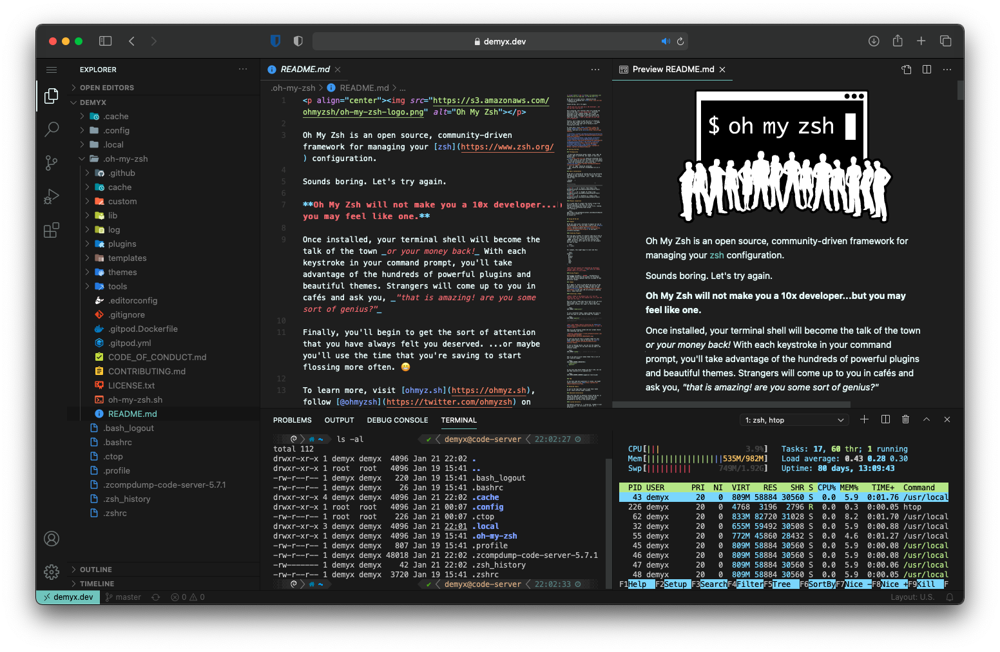

# code-server
[](https://travis-ci.org/demyxco/code-server)
[](https://hub.docker.com/r/demyx/code-server)
[](https://hub.docker.com/r/demyx/code-server)
[](https://hub.docker.com/r/demyx/code-server)
[](https://hub.docker.com/r/demyx/code-server)
[](https://hub.docker.com/r/demyx/code-server)
[](https://hub.docker.com/r/demyx/code-server)
[](https://www.buymeacoffee.com/VXqkQK5tb)
[](https://www.patreon.com/bePatron?u=23406156)

code-server is VS Code running on a remote server, accessible through the browser.

<p align="center" style="max-width: 1024px"></p>

DEMYX | CODE-SERVER
--- | ---
TAGS | bedrock browse go latest alpine openlitespeed openlitespeed-bedrock wp
PORT | 8080
USER | demyx
WORKDIR | /demyx
CONFIG | /etc/demyx
ENTRYPOINT | ["demyx-entrypoint"]
SHELL | zsh
SHELL THEME | powerlevel10k

## Usage
* SSL/TLS first!
* Requires no config file for Traefik and is ready to go when running: `docker-compose up -d`
* Upgrading from Traefik v1 to v2? You will need to convert your [acme.json](https://github.com/containous/traefik-migration-tool)

```
# Demyx
# https://demyx.sh
#
# This docker-compose.yml is designed for VPS use with SSL/TLS first.
# Traefik requires no additional configurations and is ready to go.
# Be sure to change all the domain.tld domains and credentials before running docker-compose up -d.
#
networks:
  demyx:
    name: demyx
  demyx_socket:
    name: demyx_socket
services:
  demyx_socket:
    container_name: demyx_socket
    environment:
      - CONTAINERS=1
    image: demyx/docker-socket-proxy
    networks:
      - demyx_socket
    # Uncomment below if your host OS is CentOS/RHEL/Fedora
    #privileged: true
    restart: unless-stopped
    volumes:
      - /var/run/docker.sock:/var/run/docker.sock:ro
  demyx_traefik:
    container_name: demyx_traefik
    depends_on:
      - demyx_socket
    environment:
      # Uncomment below for Cloudflare DNS challenge
      #- CF_API_EMAIL=info@domain.tld
      #- CF_API_KEY=123456
      - DEMYX_ACME_EMAIL=info@domain.tld
      - DEMYX_TRAEFIK_LOG=INFO
      - TRAEFIK_PROVIDERS_DOCKER_ENDPOINT=tcp://demyx_socket:2375
    image: demyx/traefik
    labels:
      - "traefik.enable=true"
      - "traefik.http.middlewares.demyx-traefik-auth.basicauth.users=demyx:$$apr1$$L91z3CIR$$m/BKZcnQGBP.Uo2cJm8I0/" # Basic auth password: demyx
      - "traefik.http.middlewares.demyx-traefik-redirect.redirectscheme.scheme=https"
      - "traefik.http.routers.demyx-traefik-http.entrypoints=http"
      - "traefik.http.routers.demyx-traefik-http.middlewares=demyx-traefik-redirect"
      - "traefik.http.routers.demyx-traefik-http.rule=Host(`traefik.domain.tld`)"
      - "traefik.http.routers.demyx-traefik-http.service=demyx-traefik-http-port"
      - "traefik.http.routers.demyx-traefik-https.entrypoints=https"
      - "traefik.http.routers.demyx-traefik-https.middlewares=demyx-traefik-auth"
      - "traefik.http.routers.demyx-traefik-https.rule=Host(`traefik.domain.tld`)" # Traefik dashboard https://traefik.domain.tld
      - "traefik.http.routers.demyx-traefik-https.service=api@internal"
      - "traefik.http.routers.demyx-traefik-https.service=demyx-traefik-https-port"
      - "traefik.http.routers.demyx-traefik-https.tls.certresolver=demyx"
      - "traefik.http.services.demyx-traefik-http-port.loadbalancer.server.port=8080"
      - "traefik.http.services.demyx-traefik-https-port.loadbalancer.server.port=8080"
    networks:
      - demyx
      - demyx_socket
    ports:
      - 80:8081
      - 443:8082
    restart: unless-stopped
    volumes:
      - demyx_log:/var/log/demyx
      - demyx_traefik:/demyx
  demyx_code:
    container_name: demyx_code
    depends_on:
      - demyx_traefik
    environment:
      - DEMYX=/demyx
      - DEMYX_CODE_AUTH=password
      - DEMYX_CODE_BIND_ADDR=0.0.0.0:8080
      - DEMYX_CODE_CONFIG=/home/demyx/.config/code-server
      - DEMYX_CODE_PASSWORD=demyx
      - DEMYX_CONFIG=/etc/demyx
      - DEMYX_LOG=/var/log/demyx
      - TZ=America/Los_Angeles
    hostname: code-server
    image: demyx/code-server
    labels:
      - "traefik.enable=true"
      - "traefik.http.middlewares.demyx-code-redirect.redirectscheme.scheme=https"
      - "traefik.http.routers.demyx-code-http.entrypoints=http"
      - "traefik.http.routers.demyx-code-http.middlewares=demyx-code-redirect"
      - "traefik.http.routers.demyx-code-http.rule=Host(`domain.tld`)"
      - "traefik.http.routers.demyx-code-http.service=demyx-code-http-port"
      - "traefik.http.routers.demyx-code-https.entrypoints=https"
      - "traefik.http.routers.demyx-code-https.rule=Host(`domain.tld`)"
      - "traefik.http.routers.demyx-code-https.service=demyx-code-https-port"
      - "traefik.http.routers.demyx-code-https.tls.certresolver=demyx"
      - "traefik.http.services.demyx-code-http-port.loadbalancer.server.port=8080"
      - "traefik.http.services.demyx-code-https-port.loadbalancer.server.port=8080"
    networks:
      - demyx
    restart: unless-stopped
    volumes:
      - demyx_code:/home/demyx
version: "2.4"
volumes:
  demyx_code:
    name: demyx_code
  demyx_log:
    name: demyx_log
  demyx_traefik:
    name: demyx_traefik
```

## Updates & Support
[](https://github.com/demyxco/code-server)
[](https://github.com/demyxco/code-server)
[](https://github.com/demyxco/code-server)
[](https://github.com/demyxco/code-server)
[](https://github.com/demyxco/code-server)

* Auto built weekly on Saturdays (America/Los_Angeles)
* Rolling release updates
* For support: [#demyx](https://webchat.freenode.net/?channel=#demyx)
